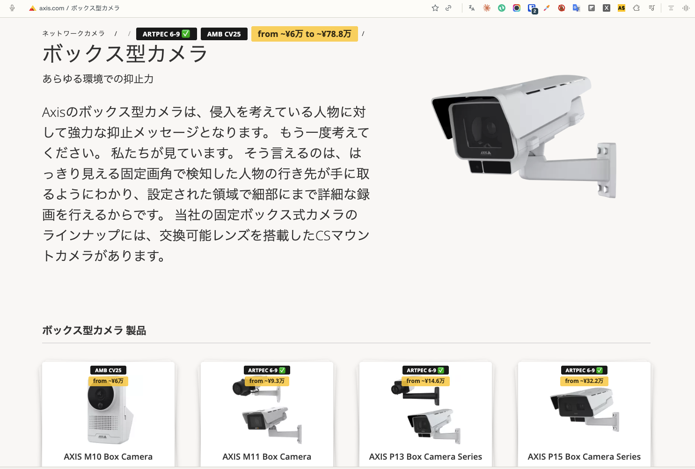
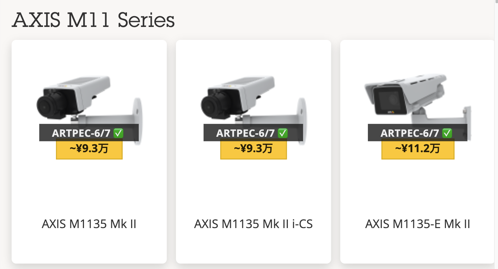

# Axis MSRP Price Overlay

See Axis MSRP list prices and chipset/hardware-generation info directly on axis.com — on the Product Selector, on search results, and on every product and category page — without opening a separate price list or spec sheet.

Built for anyone who needs pricing and chipset info at a glance while browsing axis.com: sales and channel teams, marketing, Axis resellers and partners, and Axis employees.

**Current version: 3.4.4** (EUR / USD / JPY, Japanese locale support, field-of-view filtering)

## What it shows, and where

- **Product Selector** (axis.com/support/tools/product-selector) — every camera tile gets a price badge and, where known, a chipset label. A floating **Filters** panel narrows the whole page down by chipset generation and by field of view, and series can be sorted cheapest-first.
- **Product Selector comparison page** (axis.com/support/tools/product-selector/comparison/) — when you compare products from the Product Selector, Chipset and Price rows are added right at the top of the comparison, above every other spec.
- **axis.com search results** — searching for a model (e.g. `M1137`) or a whole series (e.g. `Q35`) appends a price badge to each matching result title, plus a chipset badge when the result names one specific model.
- **Product and category pages** (axis.com/products/...):
  - Category pages (e.g. a hub page like "Box cameras," or a series page like "AXIS Q17 Box Camera Series") — every product tile gets a price badge and chipset badge(s), pinned top-center over the product image: a specific price for one model, or a "from €X" cheapest-price badge for a whole series card.
  - Top-level category hub pages (e.g. axis.com/products/network-cameras) — each tile there names a whole product category ("Box cameras," "Panoramic cameras," ...) rather than one model or series, so it gets its own "from €X" figure and chipset badges aggregated across every SKU in that category, matched via the same "section" field the AXIS Price List itself groups products by.
  - The series page breadcrumb trail shows the full "from X to Y" price range — the one place a true range is displayed — plus every chipset used across that series. The range is scoped to the models actually rendered as cards on that page, so retired same-prefix SKUs don't distort it or add phantom chipsets.
  - Individual product pages get the same price + chipset badges appended as a trailing breadcrumb crumb (falling back to under the `<h1>` if a page has no breadcrumb).
  - The "Compare products" table on a series page gets two new rows at the top — **Chipset** and **Price** — one column per model, so you can compare cost and hardware generation right alongside every other spec.
- **Toolbar popup** — look up any model name, part number, or variant directly, with price and chipset shown side by side. Results are capped at 60 rows; each row shows the part number, section, chipset badge and price.

Every price badge carries a tooltip naming the price list it came from, plus the part number, variant, bulk-pack note, or `range across N variants (X to Y)`.

On **product and category pages only**, chipset badges are grouped for readability: older ARTPEC generations collapse into "ARTPEC 3-5," CamStreamer-supported generations collapse into "ARTPEC 6-9," and Ambarella variants are shown as "AMB" plus the model code (e.g. "AMB CV25"). Everywhere else — Product Selector, search, both comparison tables, and the popup — the exact chipset label is shown (`ARTPEC-9`, `ARTPEC-6/7`, `Ambarella A5S`). CamStreamer-supported chipsets are marked with a ✅ on every surface.

## Currency — EUR, USD and JPY

A three-way **€ EUR / $ USD / ¥ JPY** toggle in the popup switches which currency is shown everywhere — Product Selector, search, product pages, and the popup itself — instantly, with no reload needed.

- **EUR** is the one authoritative figure: it comes straight from the bundled AXIS Price List, shown with two decimals and no tilde (`€1,234.00`). EUR is present for every product section except 2N (plus a handful of individual non-camera SKUs) — 325 of 377 SKUs.
- **USD** is baked into the catalog at build time and marked with a leading `~`, rounded to whole dollars (`~$1,405`). Most USD figures are FX-derived from EUR; where a SKU has no EUR entry at all, the figure is the original Axis US price list number instead.
- **JPY** is computed live from the EUR figure and shown in shortened **万** (*man*, = 10,000) units rather than a six-digit yen amount: rounded up to the nearest ¥1,000, then expressed with one decimal, dropping a trailing `.0`. So ¥372,274 renders as `~¥37.3万`, and a round amount as `~¥5万`.

Exchange rates come from [api.frankfurter.dev](https://api.frankfurter.dev) (ECB reference rates, no API key) and are cached locally. A **FX rates (EUR→USD/JPY)** panel in the popup shows the current figures and when they were last fetched — `1 EUR ≈ $1.1387 / ¥172.3 · updated 2 h ago` — with an **Update** button to refresh on demand. Rates also refresh automatically on install, on browser startup, and weekly. Since JPY is the only currency that needs a live rate, JPY badges are suppressed rather than guessed when no rate has been cached yet, and the popup shows `— (no rate yet)`; EUR and USD are unaffected.

## Japanese and other axis.com locales

The extension works on every localized axis.com path (`/ja-jp/`, `/en-us/`, `/pt-br/`, ...), not just the bare English URLs.

- **Locale-aware default currency.** On first run, the currency is inferred from the URL you're browsing: Japanese locales → **JPY**, Americas locales → **USD**, everything else → **EUR**. The inferred value is saved so the popup and every open tab agree. Once you pick a currency yourself, your choice always wins.
- **Japanese disclaimer text.** Selecting ¥ JPY swaps the popup's footer disclaimer to a full Japanese translation (MSRP vs. street price, the price-list vintage, the FX-derived nature of the yen figure, and the chipset data source).
- **Locale-independent matching.** Badges are placed using CSS classes and URL slugs rather than visible English text, so category hub tiles resolve correctly even when they read "ボックス型カメラ" or "Câmeras dome". Model designators (AXIS M1135 Mk II, Q6086-E) stay Latin on every locale, so model matching is unaffected.

Note that on-page injected labels ("Chipset", "Price", "Min. field of view", "Sort series by cheapest price") and the options page remain in English.

## Filters panel (Product Selector)

The floating panel, bottom-right, collapsible, with an `N / M shown` counter (displayed only while a filter is active) and a **Clear** button that clears the chipset selection and resets the FOV slider:

- **Chipset filter** — grouped checkboxes for `ARTPEC-9`, `ARTPEC-8`, `ARTPEC-6/7`, `ARTPEC-3/4/5` and `Ambarella` (covering CV75/CV25/S3L/S2L/S2E/A5S), plus two quick presets:
  - **CamStreamer Support** → ARTPEC-9, ARTPEC-8, ARTPEC-6/7.
  - **Baseball Tracker** → ARTPEC-9 and ARTPEC-8 only, the DLPU-capable chipsets that app requires.

  Presets and individual checkboxes stay in sync both ways.
- **Min. field of view** — a slider from 0° (off) to 180° that hides cameras whose published horizontal FOV never reaches the threshold. It matches on each model's **widest** figure, so a varifocal qualifies if its wide end is wide enough. The filter is **fail-open**: models with no FOV data yet always stay visible.
- **Sort series by cheapest price** — on by default. Series are ranked by their cheapest *currently visible* card, so the order re-ranks as you change filters. Series with zero visible cards are always hidden, which in practice only shows up once a filter is narrowing things down. (The **Clear** button doesn't touch this checkbox.)

Chipset and FOV filters combine with AND, and all three settings persist between visits.

### FOV data

FOV figures are hand-curated from each model's own axis.com Technical specifications table (Lens → Horizontal field of view), since there's no scrapeable source. Coverage is deliberately partial and grows series by series — currently 80 entries covering one representative model per M/P/Q sub-series, the F/FA modular sensors, and per-lens-option thermal SKUs (e.g. `Q1961-TE 7 MM`). Values range from 2.0° (Q6086-E at full tele) to 360° (P3747-PLVE). This is why the filter is fail-open. Unlike chipset data, FOV data does not auto-refresh.

## Keeping prices current

The extension ships with a recent Axis public price list bundled in as the default — currently the **AXIS Price List, July 2026 (EUR)**, with USD derived at EUR/USD = 1.1387 (xe.com, 2026-07-14). Axis publishes a new price list roughly every month, and refreshing is built in — no reinstall, no waiting on a new extension version:

1. Click the extension icon, then the **⚙** gear button next to the theme toggle.
2. Drag the new month's official AXIS Price List `.xls`/`.xlsx` file onto the drop zone (or click to pick the file). Everything happens locally in your browser — the file itself never leaves your machine.
3. The standard AXIS Price List format is recognized and mapped automatically: sheets named "All products" then "Camera" are prioritized, the header row is guessed, and columns are matched by name pattern. For anything else (a different layout, a one-off export), a simple column-mapping screen lets you point out which column is the model name, which is the price, and so on, with a live preview before anything is applied.
4. **Source currency** can be € EUR, $ USD or ¥ JPY, auto-sniffed from the first few rows of the file. An editable **EUR→USD** rate is shown for EUR and JPY files (a JPY file is converted JPY → EUR → USD via an additional **EUR→JPY** field); a USD file is taken verbatim and needs no rate. Rates are auto-fetched from api.frankfurter.dev with the ECB reference date shown, and editing one re-derives the figures before you apply. A free-text **Source label** field records where the data came from, shown on the settings page's own status line.
5. Before committing, you'll see a coverage report — how many products matched, split into part-number matches vs. name fallbacks, broken down by category, plus any unmatched SKUs — so you know exactly what changed.
6. **Revert to bundled prices** is always available if you want to go back to the default data that shipped with the extension.

## Keeping chipset info current

Chipset labels are sourced from CamStreamer's published camera-compatibility list and refresh automatically on install, on browser startup, and about once a week. A manual **Update** button in the popup refreshes it on demand at any time. A sanity floor of 200 models guards the data: if CamStreamer's markup ever changes and fewer models parse, good data isn't overwritten and the error surfaces in the popup status line.

## Other popup details

- Header shows the version read from the manifest, plus a **🌓 light/dark theme toggle**. The settings page has no toggle of its own but follows whatever the popup is set to.
- Subtitle counter: `N models / M SKUs loaded`.
- Chipset status line: `N models · updated 3 days ago`, or the failure reason.

## Installing

Install from the Chrome Web Store: **[Axis MSRP Price Overlay](https://chromewebstore.google.com/detail/axis-msrp-price-overlay/gnegcekipfaapeboifcejnjmfemfigpl)** → **Add to Chrome**. No developer mode, and Chrome keeps it updated from then on.

Any axis.com tabs you already have open (Product Selector, search, product/category pages) pick it up automatically within a moment — including locale-prefixed URLs like `/ja-jp/` — with no need to reload or visit a specific page first.

### Running from source

For development, or to run a build before it reaches the store: open `chrome://extensions`, turn on **Developer mode**, click **Load unpacked**, and select this folder. Unpacked installs don't auto-update — click **Reload** on the extension card after pulling changes.

### Packaging note

When zipping this up for the Chrome Web Store developer dashboard, the dashboard enforces a **132-character limit on `manifest.json`'s `description` field** — longer than that, and the upload is rejected with "The description field in manifest is too long." Keep any future edits to `description` under that limit.

## Privacy

No data collection, no analytics, no accounts. The only network requests are to camstreamer.com (chipset compatibility list) and api.frankfurter.dev (ECB exchange rates), both declared in the manifest. Price-list files you upload are parsed entirely in your browser and never leave your machine.

## Documentation

A full illustrated overview lives in `docs/`:

- English: [`docs/index.html`](docs/index.html)
- 日本語: [`docs/index.ja.html`](docs/index.ja.html)
